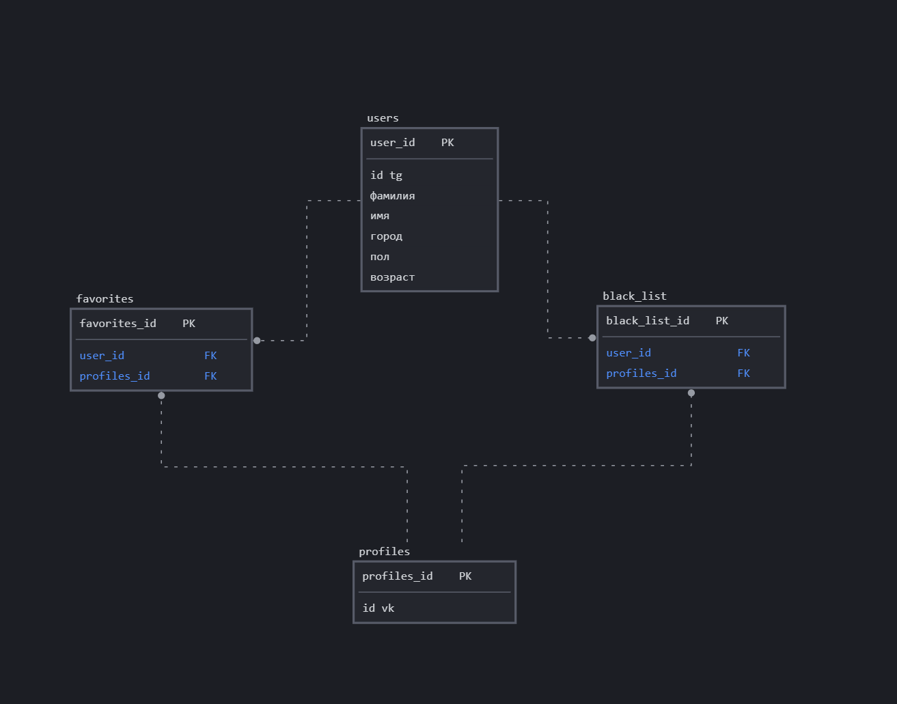

## Структура проекта

```plaintext
vk-dating-bot/            # Корневая директория проекта
│
├── docs/                 # Директория с документацией
│   ├── index.md          # Основной файл документации
│   ├── installation.md   # Инструкция по установке
│   └── usage.md          # Инструкция по использованию
│
├── src/                  # Директория с исходным кодом проекта
│   ├── bot/              # Модуль, связанный с логикой бота
|   |   ├── utils/
|   |   |   ├── __init__.py
|   │   │   ├── utils.py  # Утилиты
│   │   ├── __init__.py   # Инициализационный файл модуля
│   │   ├── commands.py   # Обработка команд пользователя (например, /start, /help)
│   │   └── handlers.py   # Обработка сообщений и взаимодействий с ботом
│   │
│   ├── db/               # Модуль для работы с базой данных
|   |   ├── utils/
|   |   |   ├── __init__.py
|   │   │   ├── utils.py  # Утилиты
│   │   ├── __init__.py   # Инициализационный файл модуля
│   │   ├── models.py     # Определение моделей данных (таблиц базы данных)
│   │   └── database.py   # Подключение к базе данных и выполнение определенных операций
│   │
│   ├── vk_api/           # Модуль для взаимодействия с API ВКонтакте
|   |   ├── utils/
|   |   |   ├── __init__.py
|   │   │   ├── utils.py  # Утилиты
│   │   ├── __init__.py   # Инициализационный файл модуля
│   │   ├── vk_client.py  # Класс клиента для работы с VK API
│   │   └── vk_utils.py   # Утилиты для работы с VK API (например, запросы)
│   │
│   ├── app.py            # Главный файл приложения, запускающий бота и веб-сервер
│   └── config.py         # Файл конфигурации, содержащий все настройки проекта
│
├── tests/                # Директория с тестами
│   ├── test_bot.py       # Тесты для логики бота
│   ├── test_db.py        # Тесты для работы с базой данных
│   ├── test_vk_api.py    # Тесты для взаимодействия с VK API
│   └── test_integration.py # Интеграционные тесты для проверки взаимодействия компонентов
│
├── requirements.txt      # Файл со списком зависимостей проекта
├── README.md             # Основной файл README с описанием проекта
└── .gitignore            # Файл для исключения из контроля версий ненужных файлов
```

## Документация

Подробная документация по установке, настройке и использованию проекта доступна в директории `docs/`.

- [Основная документация](docs/index.md)
- [Инструкция по установке](docs/installation.md)
- [Инструкция по использованию](docs/usage.md)


## Схема бд



### Перед запуском проекта

Перед запуском проекта необходимо установить все зависимости, используя файл `requirements.txt`. Также необходимо создать файл `.env` и заполнить его следующим образом:

```
TOKEN=
USER=
PASSWORD=
NAME=
HOST=
PORT=
```

`TOKEN`: токен вашего бота.

`USER`, `PASSWORD`, `NAME`, `HOST`, `PORT`: данные для подключения к базе данных.